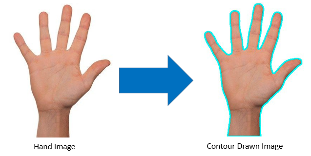
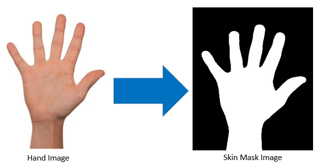
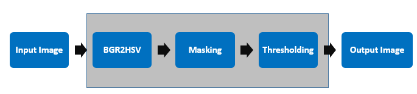

# Embedded Security (SS21) Final Project: Hand Gesture Detector (From Images not videos) 

> Tabdar Khan (@tb15228), Siraj Munir (@sm11293)


## Overview

We have impemented initial algorithms to **detect hand gestures from images** using `software` and then accelerating the algorithm using `PYNQ-Z2 FPGA board` using `Vitis Vision Libraries`.

### Software Approach

### Programmable Logic Approach


## Challenges
We had to stop at skin masking step in the PL logic because **Vitis Vision Libraries** do not support finding and drawing contours yet. The Comparison between PS and PL is done till that step.

## Steps in the algorithm


## Building
Once into the project folder, Compile and create the Vivado project using the `makefile`. Run:
```sh
make
```
This will download the vitis libraries, make the hls-proj using Vitis HLS and make the rtl-proj using Vivado and interconnect everything as well. *Cheers to the power of makefiles! :)*
<br>
<br>
**NOTE :** `make` will additionally create symbolic links to the **hardware handoff** and **overlay** files in the working directory.

## Usage
Run the Jupyter Notebook on your **PYNQ Boards**.

## References

1. [OpenCV Documentation for Python](https://docs.opencv.org/3.4/index.html) 
2. [Xilinx documentation on using ZYNQ-7000 with OpenCV](https://www.xilinx.com/support/documentation/application_notes/xapp1167.pdf)
3. [Hand Gesture Recognition using OPENCV in python](https://medium.com/analytics-vidhya/hand-detection-and-finger-counting-using-opencv-python-5b594704eb08)
